# Project Plan · Chatbox lơ lửng (Floating Chatbox)

## 1. Project Overview

- **Feature Summary**: Một chatbox nổi (kiểu iOS) gắn vào mọi trang học của app `ôn thi`. Người dùng đã đăng nhập có thể chat realtime theo phòng (Supabase `config` polling, giống challenge rooms), gửi tin nhắn thoại (≤60s, base64), và hỏi AI **riêng tư** bằng `/ai` qua **opencode serve** HTTP API.
- **Success Criteria**:
  - Chatbox hiển thị trên tất cả trang học sau khi login (tương tự timer bubble).
  - Tin nhắn realtime giữa mọi tài khoản (polling ~1s), unread badge hoạt động khi panel đóng.
  - Voice gửi/phát được, giới hạn 60s / ~1.5MB.
  - `/ai` mở thread riêng, trả lời khi `opencode serve` chạy; báo lỗi thân thiện khi offline.
- **Key Milestones** (đã xong):
  - Enabler: backend chat trong `supabase.js` (1)
  - Story: widget UI + rooms + voice + AI (2)
  - Deployment: script tag các trang + `sw.js` precache + cache bust (3, 4)
  - Tooling: helper `start-ai-server.command` (5)
- **Risk Assessment**:
  | Risk | Mitigation |
  |------|-----------|
  | Voice base64 làm phình `config` payload | Chặn >1.5MB, giới hạn 60s, cảnh báo UI |
  | AI cần server local + provider | Helper script + hướng dẫn `/connect`; lỗi offline hiển thị inline |
  | RLS cho phép anon ghi `config` | Tuân theo pattern sẵn có (quiz/challenge đã ghi anon) |
  | Cache cũ (PWA) phục vụ supabase.js cũ | Bump `?v=16`, cache name `h2fo3t-v90` |

## 2. Work Item Hierarchy

```mermaid
graph TD
    A[Epic: Chatbox lơ lửng] --> B[Feature: Floating Chat Widget]
    A --> C[Feature: Realtime Chat Rooms]
    A --> D[Feature: Voice Messages]
    A --> E[Feature: AI Assistant /ai]
    A --> F[Enabler: Backend chat trên supabase]
    A --> G[Enabler: Caching / Deploy]

    B --> B1[Story: Bubble collapse/expand + drag]
    B --> B2[Story: Panel rooms list + thread]
    B --> B3[Enabler: SF-Style SVG icons]

    C --> C1[Story: 4 phòng mặc định + tạo phòng mới]
    C --> C2[Story: Presence online count]
    C --> C3[Story: Unread badge per room]

    D --> D1[Story: Record ≤60s → base64 → gửi DB]
    D --> D2[Story: Playback voice với waveform]

    E --> E1[Story: Thread 1-1 với AI]
    E --> E2[Enabler: opencode serve HTTP integration]
    E --> E3[Enabler: start-ai-server.command]

    F --> F1[Task: learn:chat:room / msg helpers]
    F --> F2[Task: subscribeChatRoom polling + diff]
    F --> F3[Test: node --check + export test]
```

## 3. GitHub Issues Breakdown (đã thực hiện)

| Issue | Title | Loại | Trạng thái |
|-------|-------|------|-----------|
| 1 | Backend chat trên `supabase.js` (rooms, msgs, presence, subscribe) | Enabler | ✅ |
| 2 | `chatbox.js`: widget nổi + panel + rooms + unread + drag | Feature | ✅ |
| 3 | Voice (MediaRecorder ≤60s, base64) | Story | ✅ |
| 4 | AI thread `/ai` qua opencode serve (session + message) | Story | ✅ |
| 5 | Thêm script tag + bump `?v=16` trên 26 trang học | Task | ✅ |
| 6 | `sw.js` precache + cache name `v90` | Enabler | ✅ |
| 7 | `start-ai-server.command` | Enabler | ✅ |
| 8 | Manual QA (chat, voice, AI offline, PWA cache) | Test | ⏳ chờ user |

## 4. Priority & Value Matrix

| Issue | Priority | Value | Labels |
|-------|----------|-------|--------|
| Backend chat helpers | P0 | High | `enabler`, `database/backend` |
| Floating widget + rooms | P0 | High | `feature`, `frontend` |
| Unread badge / presence | P1 | Medium | `user-story`, `frontend` |
| Voice messages | P1 | Medium | `user-story`, `frontend` |
| AI `/ai` | P1 | High | `feature`, `integration` |
| Caching / script tags | P2 | Medium | `enabler`, `infrastructure` |

## 5. Definitions of Done

- [ ] `node --check chatbox.js` + `supabase.js` pass; chat helpers exported (verified)
- [ ] 26 trang học đều load `chatbox.js`; `supabase.js?v=16`
- [ ] `sw.js` precache + version bump `h2fo3t-v90`
- [ ] Chat thử 2 tài khoản: gửi/receive realtime, voice, unread badge
- [ ] `/ai` hoạt động khi `opencode serve` chạy; báo lỗi khi offline